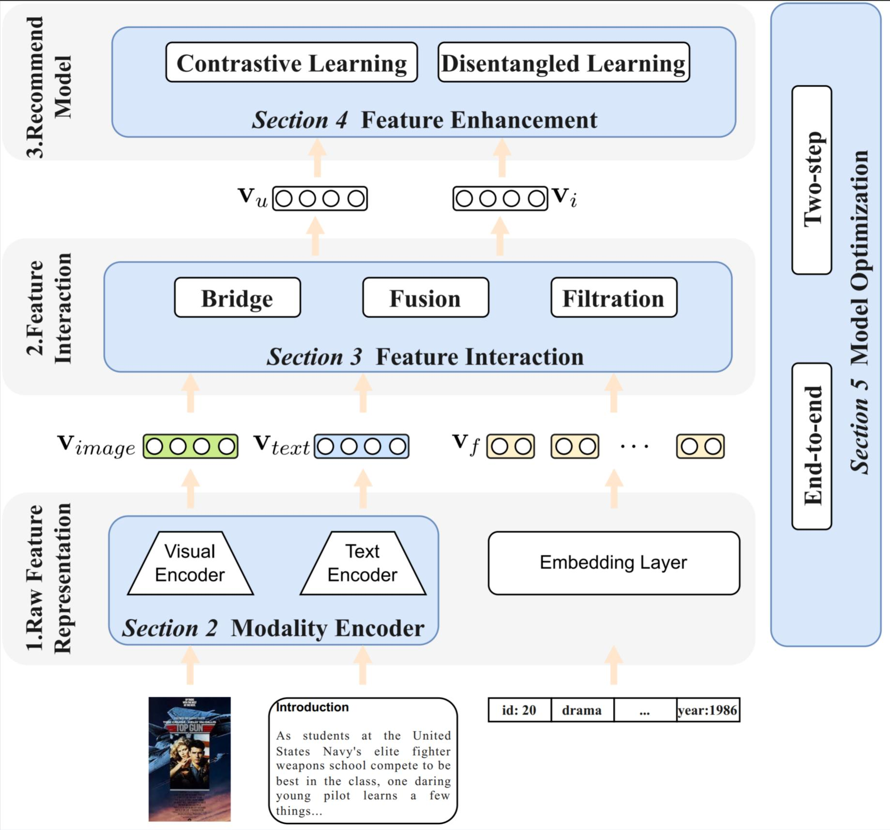

# Multimodal Recommender Systems: A Survey

A collection of resources and papers of __Multimodal Recommender Systems__ (MRS).

:fire::fire: We will update the repo sustainably!

## 1. Our Survey

In our survey, we conclude the general MRS as an unified process, including Raw Feature Representation, Feature Interaction and Recommend Model. To face with the challenges contained in each procedure, we classify the existing works according to four branch of techniques, i.e., __Modality Encoder__, __Feature Interaction__, __Feature Enhancement__ and __Optimization__.

More details can be seen in our survey.

## 2. Open-sourced Repositories

MMRec

Cornec

## 3. Datasets

## 4. Paper List

| Name  | Paper                                                        | Feature Interaction      | Feature Enhancement | Optimization | Venue   | Code                                       |
| ----- | ------------------------------------------------------------ | ------------------------ | ------------------- | ------------ | ------- | ------------------------------------------ |
| N/A   | [Multi-Modal Contrastive Pre-training for Recommendation](https://dl.acm.org/doi/pdf/10.1145/3512527.3531378) | Coarse-grained Attention | CL                  | End-to-end   | ICMR'22 | N/A                                        |
| MMGCN | [MMGCN: Multi-modal graph convolution network for personalized recommendation of micro-video](https://dl.acm.org/doi/pdf/10.1145/3343031.3351034) |                          |                     |              | MM'23   | [link](https://github.com/weiyinwei/MMGCN) |
|       |                                                              |                          |                     |              |         |                                            |
|       |                                                              |                          |                     |              |         |                                            |
|       |                                                              |                          |                     |              |         |                                            |
|       |                                                              |                          |                     |              |         |                                            |
|       |                                                              |                          |                     |              |         |                                            |
|       |                                                              |                          |                     |              |         |                                            |
|       |                                                              |                          |                     |              |         |                                            |
|       |                                                              |                          |                     |              |         |                                            |
|       |                                                              |                          |                     |              |         |                                            |
|       |                                                              |                          |                     |              |         |                                            |
|       |                                                              |                          |                     |              |         |                                            |
|       |                                                              |                          |                     |              |         |                                            |
|       |                                                              |                          |                     |              |         |                                            |
|       |                                                              |                          |                     |              |         |                                            |
|       |                                                              |                          |                     |              |         |                                            |
|       |                                                              |                          |                     |              |         |                                            |
|       |                                                              |                          |                     |              |         |                                            |
|       |                                                              |                          |                     |              |         |                                            |
|       |                                                              |                          |                     |              |         |                                            |
|       |                                                              |                          |                     |              |         |                                            |
|       |                                                              |                          |                     |              |         |                                            |
|       |                                                              |                          |                     |              |         |                                            |
|       |                                                              |                          |                     |              |         |                                            |
|       |                                                              |                          |                     |              |         |                                            |
|       |                                                              |                          |                     |              |         |                                            |
|       |                                                              |                          |                     |              |         |                                            |
|       |                                                              |                          |                     |              |         |                                            |
|       |                                                              |                          |                     |              |         |                                            |
|       |                                                              |                          |                     |              |         |                                            |
|       |                                                              |                          |                     |              |         |                                            |
|       |                                                              |                          |                     |              |         |                                            |
|       |                                                              |                          |                     |              |         |                                            |
|       |                                                              |                          |                     |              |         |                                            |
|       |                                                              |                          |                     |              |         |                                            |
|       |                                                              |                          |                     |              |         |                                            |
|       |                                                              |                          |                     |              |         |                                            |
|       |                                                              |                          |                     |              |         |                                            |
|       |                                                              |                          |                     |              |         |                                            |
|       |                                                              |                          |                     |              |         |                                            |
|       |                                                              |                          |                     |              |         |                                            |
|       |                                                              |                          |                     |              |         |                                            |
|       |                                                              |                          |                     |              |         |                                            |
|       |                                                              |                          |                     |              |         |                                            |
|       |                                                              |                          |                     |              |         |                                            |
|       |                                                              |                          |                     |              |         |                                            |
|       |                                                              |                          |                     |              |         |                                            |
|       |                                                              |                          |                     |              |         |                                            |

